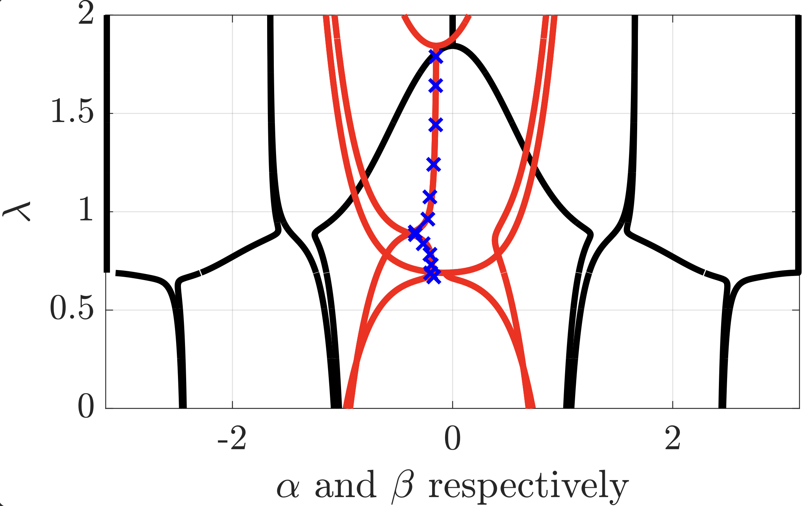
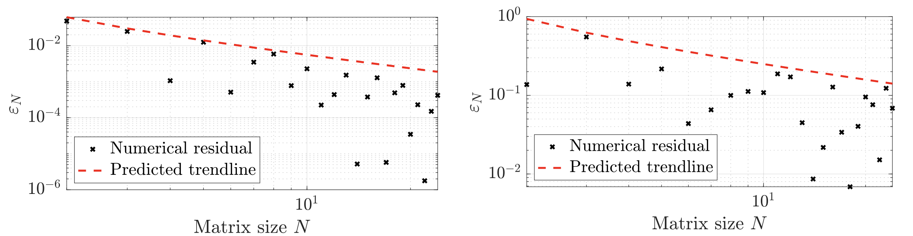
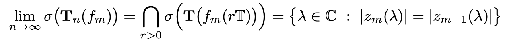
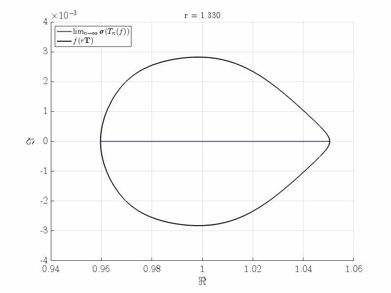
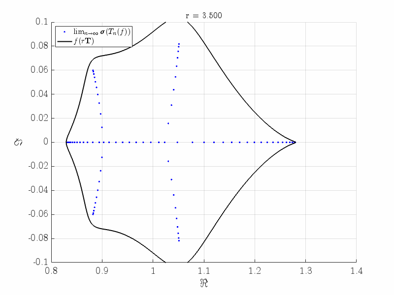
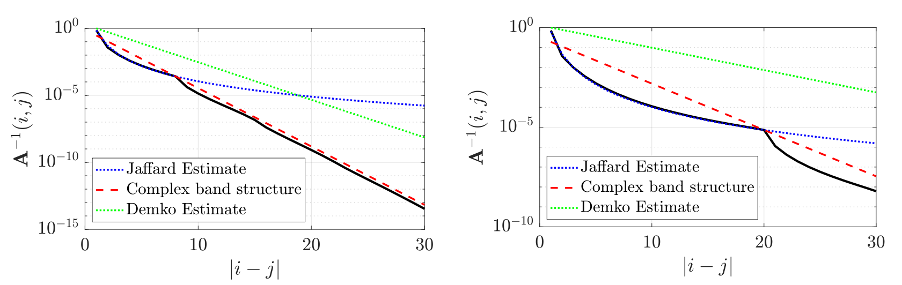
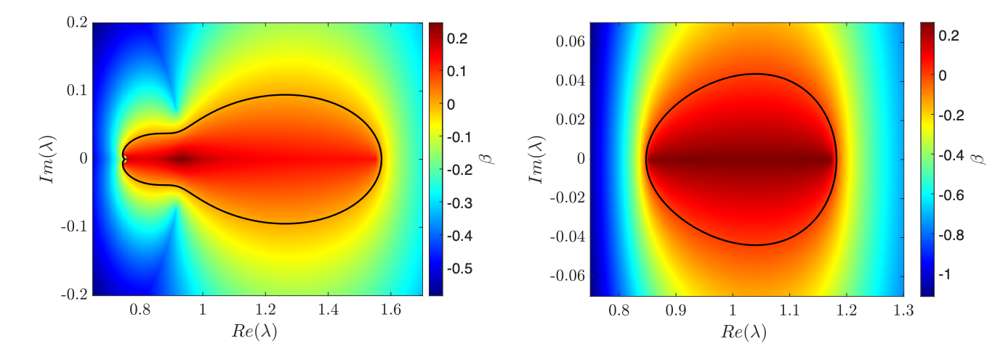

# Spectra of m-Banded Toeplitz operators

**Authors:** Y. DE BRUIJN and  E. O. HILTUNEN
**Date:** 9.11.2025

---

In this computational notebook, we provide the MATLAB code for the computations in [1].

## II.1 The complex band structure
We plot the phase and the magnitude of the roots to the polynomial $f_m(z) - \lambda = 0$ as a function of real valued $\lambda$. The code `CBScontinuous.m` is implemented via a root tracking algorithm and plots the roots directly as $z(\lambda)$. Another method is to compute the roots sparately for each $\lambda$, this is also implented in `CBSscatter.m`.

The blue crosses that are overlayed with the complex band denote the numerically computet exponential decay rates of the eigenvector sof Toeplitz matrices.

- `CBScontinuous.m`

  

The exponential decay length of the eigenvectors of non-Hermitian $m$-banded Toeplitz operators depends on the number of bands considered. We numerically illustrate that the decay length goes to zero as the bandwidth becomes large.

- `ConvergenceFloquetParameter.m`

  

## II.2 Convergence of Pseudospectra
- `PseudospectrumConvergence.m`

  

## II.4 Open spectrum

This animation illustrates how the open spectrum comprises the interfection of the spectra of Topelitz operators evalueted on the $r$-scaled torus, i.e.

  

- `CollapseSymbolMovie.m`

   
   

## II.4 Reality of open limit

- `JaffardCBSEstimate.m`

  

## II.5 Defect Modes

We numerically illusrate the composite decay bounds which act on defect modes.

- `JaffardCBSEstimate.m`

  

## II.6 Complex valued frequency

In some cases, the open spectrum of the pristine Toeplitz operator, ot generally for defect modes, we no longer have real valued eigenvalues. Therefore we extend the spectral plot from `CBScontinuous.m`, to complex valued frequencies. In the code for `CBScomplexLambda.m`, we compute the roots for $f_m(z)-\lambda = 0$, we sort the soots in ascending order $|z_1| \leq \dots |z_m| \leq |z_{m+1}| \leq \dots \leq |z_{2m}|$, and plot $\beta$ where  $e^{-\beta} = |z_{m+1}|$. Clearly for a frequency $\lambda \in \sigma_{\text{wind}}$ it holds that $|z_{m+1}| < 1$, for which region $\beta > 0$.

- `CBScomplexLambda.m`

  

## III. Non-Hermitian Skin effect

The code for simulating the non-Hermitian skin effect in $3$-dimensional systems may be consulted in the following repository https://github.com/jinghaocao/skin_effect and in the following paper [2].

## IV. References

When using the code in the repository, please cite the following reference:

[1] De Bruijn, Y. and Hiltunen, E.O. (2025), *Complex Band Structure and localisation transition for tridiagonal non-Hermitian k-Toeplitz operators with defects*. 
https://doi.org/10.48550/arXiv.2505.23610

[2] Habib Ammari, Silvio Barandun, Jinghao Cao, Bryn Davies, Erik Orvehed Hiltunen, Ping Liu, *The non-Hermitian skin effect with three-dimensional long-range coupling.* J. Eur. Math. Soc. (2025), https://ems.press/journals/jems/articles/14299016

