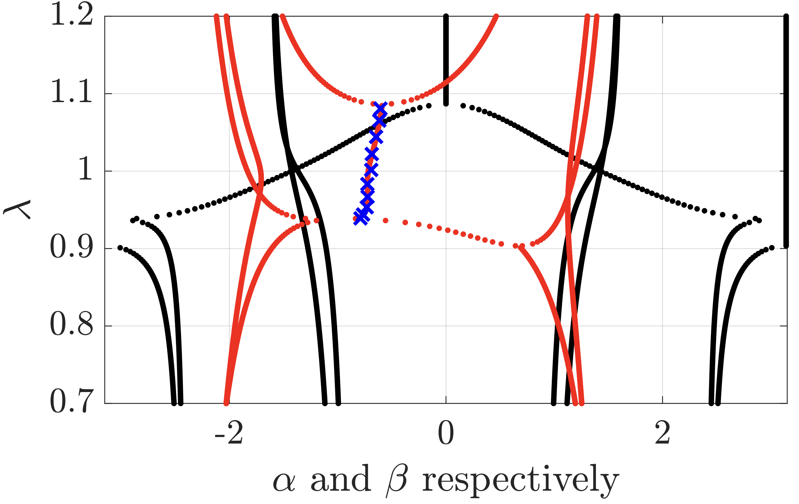

<h1 align="center">Spectra of <i>m</i>-Banded Toeplitz Operators</h1>

  <b>Y. DE BRUIJN</b> and <b>E. O. HILTUNEN</b> 
  <i>University of Oslo</i> 
  November 9, 2025

  

**Abstract:** We provide the complete computational framework supporting the theoretical results in [1].

## II.1 The Complex Band Structure

We plot the phase and magnitude of the roots of fm(z) − λ = 0 using two approaches:

**Root Tracking Algorithm** (`CBScontinuous.m`)  
Continuously tracks roots as λ varies, plotting z(λ) directly. Blue crosses overlay the complex band structure, denoting numerically computed exponential decay rates of Toeplitz matrix eigenvectors.

 
   

**Discrete Root Finding** (`CBSscatter.m`)  
Computes roots independently for each λ value.

 
 
   

## II.2 Convergence of Floquet Parameters

The exponential decay length of eigenvectors for non-Hermitian *m*-banded Toeplitz operators depends on the bandwidth. We numerically demonstrate that decay length approaches zero as bandwidth increases.

**Convergence of Floquet Parameters** (`ConvergenceFloquetParameter.m`)

 
   

## II.3 Convergence of Pseudospectra

We demonstrate the convergence behavior of pseudospectra for finite truncations of *m*-banded Toeplitz operators.

**Pseudospectrum** (`PseudospectrumConvergence.m`)

 
   

## II.4 Spectrum of Open Limit

This animation illustrates how the open spectrum comprises the intersection of spectra of Toeplitz operators evaluated on the *r*-scaled torus:

$$\lim_{n\to\infty} \sigma\left(\mathbf{T}_n(f_m)\right) = \bigcap_{r>0} \sigma\left(\mathbf{T}\left(f_m(r\mathbb{T})\right)\right) = \left\lbrace \lambda \in \mathbb{C} ~:~ |z_{m}(\lambda)| = |z_{m+1}(\lambda)| \right\rbrace$$

**Collapsed symbol Movie** (`CollapseSymbolMovie.m`)

    <em>Figure 1: Open spectrum collapse (real)</em> 
 
    <em>Figure 2: Open spectrum collapse (complex)</em> 

 
  
  

## II.5 Reality of the Open Limit

We verify numerically that the open limit produces real-valued spectra providet that $\Lambda(f_m)$ is traced out by a polar curve.

**Set $\Lambda(f)$** (`OpenLimit.m`)

 
   

## II.6 Defect Modes

We numerically illustrate composite decay bounds acting on defect modes, demonstrating localization phenomena in perturbed systems.

**Eigenvector Decay Estimates** (`JaffardCBSEstimate.m`)

 
   

## II.7 Complex-Valued Frequencies

For the open spectrum of pristine Toeplitz operators—and more generally for defect modes—eigenvalues are no longer restricted to the real line. We extend the analysis from `CBScontinuous.m` to complex-valued frequencies.

**Method:**  
For each λ, we compute roots of *f**m*(*z*) − λ = 0 and sort them in ascending order by magnitude: |*z*₁| ≤ ⋯ ≤ |*z**m*| ≤ |*z**m*+1| ≤ ⋯ ≤ |*z*₂*m*|. We then plot the decay parameter β where *e*−β = |*z**m*+1|. For frequencies λ ∈ σwind, we have |*z**m*+1| < 1, corresponding to the region where β > 0.

**Complex Band Structure** (`CBScomplexLambda.m`)

 
   

## II.8 Hermitian Matrices

For symbol functions with symmetric coefficients, the symbol can be expressed using trigonometric functions:

$$f_m(e^{i(\alpha + i \beta)}) = a_0 + 2 \sum_{k = 1}^m a_k\bigl(\cos(\alpha k)\cosh(\beta k) - 2i\sin(\alpha k)\sinh(\beta k) \bigr)$$

The imaginary part vanishes along specific paths in the complex plane. Consequently, allowed quasimomenta must be restricted to these contours.

**$\alpha$ and $\beta$ path** (`RealSymbolContour.m`)

 
   

## III. Non-Hermitian Skin Effect

Code for simulating the non-Hermitian skin effect in 3-dimensional systems is available at:  
**Repository:** https://github.com/jinghaocao/skin_effect

See also the accompanying paper [2] for theoretical background and additional numerical methods.

## IV. References

> [1] Davies, B., De Bruijn, Y., Dupuy, S. and Hiltunen, E.O. (2025), *TODO*

> [2] Habib Ammari, Silvio Barandun, Jinghao Cao, Bryn Davies, Erik Orvehed Hiltunen, Ping Liu, *The non-Hermitian skin effect with three-dimensional long-range coupling.* J. Eur. Math. Soc. (2025), https://ems.press/journals/jems/articles/14299016

## Citation

If you use this code in your research, please cite:

> Davies, B., De Bruijn, Y., Dupuy S. and Hiltunen, E.O. (2025), *TODO*

